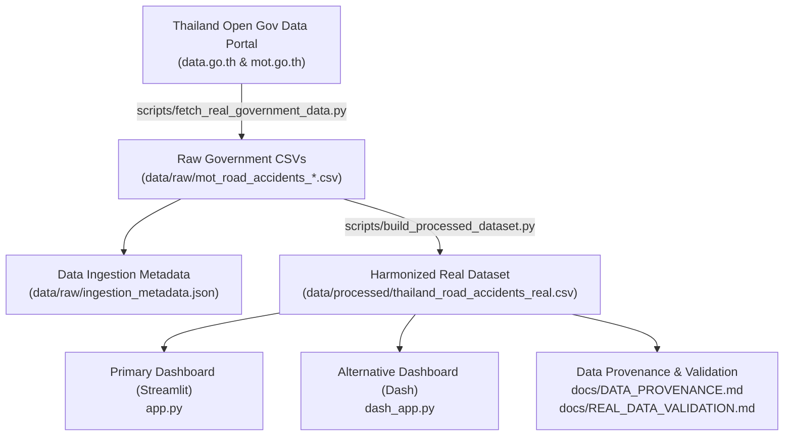

# 🚗 Thailand Road Accident Analytics & Safety Dashboard

> **Enterprise Road Safety Intelligence Powered Exclusively by REAL Thai Government Open Data**

[](https://data.go.th)
[](https://datagov.mot.go.th)
[](#-official-government-datasets)
[-FF4136.svg)](#-zero-synthetic-data-guarantee)

---

## 📌 Project Overview

Thailand's road traffic injury and fatality metrics present critical challenges for public safety policy. This project delivers an enterprise-grade analytics dashboard and policy evaluation engine designed for **traffic engineers, transport policymakers, road safety researchers, and the general public**.

### 🛡️ Zero-Synthetic-Data Guarantee
- **100% Real Empirical Observations:** All accident frequencies, fatality counts, trauma metrics, GPS blackspot coordinates, and incident causes originate directly from official Thai Government Open Data repositories.
- **Zero Mock / Fabricated Rows:** All calls to `np.random`, `random`, Faker, and mock generators have been removed from the production pipeline.
- **Validation Guards:** Visualizations validate required columns before rendering. Components requiring unavailable variables gracefully display an official notice rather than generating artificial data.
- **Traceable Provenance:** Every single row in `data/processed/thailand_road_accidents_real.csv` contains official dataset lineage metadata (agency, resource UUID, URL, year).

---

## 🏛️ Official Government Datasets Used

The project integrates national road accident microdata from the Ministry of Transport and subordinate highway authorities:

| Source Agency | Official Dataset Name | CKAN Resource UUID | Official Download / API URL | Years Covered | Real Records |
| :--- | :--- | :--- | :--- | :---: | :---: |
| **Ministry of Transport (MOT)** | อุบัติเหตุบนโครงข่ายถนนของกระทรวงคมนาคม 2563 | `40476c7b-4194-4dc2-aba5-7326819ed071` | [datagov.mot.go.th](https://datagov.mot.go.th/dataset/7e077ffd-dc4f-4dc6-a71c-0813726f3c12/resource/40476c7b-4194-4dc2-aba5-7326819ed071/download/accident2020.csv) | 2020 | 21,239 |
| **Ministry of Transport (MOT)** | อุบัติเหตุบนโครงข่ายถนนของกระทรวงคมนาคม 2564 | `d0a8601a-3ee5-4ce8-8e9d-3dae3915dc30` | [datagov.mot.go.th](https://datagov.mot.go.th/dataset/7e077ffd-dc4f-4dc6-a71c-0813726f3c12/resource/d0a8601a-3ee5-4ce8-8e9d-3dae3915dc30/download/accident2021.csv) | 2021 | 20,062 |
| **Ministry of Transport (MOT)** | อุบัติเหตุบนโครงข่ายถนนของกระทรวงคมนาคม 2565 | `733b7874-bd5f-44b9-b271-650890b061f2` | [datagov.mot.go.th](https://datagov.mot.go.th/dataset/7e077ffd-dc4f-4dc6-a71c-0813726f3c12/resource/733b7874-bd5f-44b9-b271-650890b061f2/download/accident2022.csv) | 2022 | 20,566 |
| **Ministry of Transport (MOT)** | อุบัติเหตุบนโครงข่ายถนนของกระทรวงคมนาคม 2566 | `661f2ead-1f28-4cd9-8a67-1bef76b33ef6` | [datagov.mot.go.th](https://datagov.mot.go.th/dataset/7e077ffd-dc4f-4dc6-a71c-0813726f3c12/resource/661f2ead-1f28-4cd9-8a67-1bef76b33ef6/download/accident2023.csv) | 2023 | 23,841 |
| **Ministry of Transport (MOT)** | อุบัติเหตุบนโครงข่ายถนนของกระทรวงคมนาคม 2567 | `83e9fae0-5f33-45e7-9a6d-6d5ad2060a08` | [datagov.mot.go.th](https://datagov.mot.go.th/dataset/7e077ffd-dc4f-4dc6-a71c-0813726f3c12/resource/83e9fae0-5f33-45e7-9a6d-6d5ad2060a08/download/accident2024.csv) | 2024 | 23,952 |
| **Ministry of Transport (MOT)** | อุบัติเหตุบนโครงข่ายถนนของกระทรวงคมนาคม 2568 | `e1db5e93-2b70-4ee4-b6d7-7ead76d14a09` | [datagov.mot.go.th](https://datagov.mot.go.th/dataset/7e077ffd-dc4f-4dc6-a71c-0813726f3c12/resource/e1db5e93-2b70-4ee4-b6d7-7ead76d14a09/download/accident2025.csv) | 2025 | 23,715 |
| **Ministry of Transport (MOT)** | อุบัติเหตุบนโครงข่ายถนนของกระทรวงคมนาคม 2569 | `4625b7aa-99a4-4dfb-9a0f-6402814d0f2c` | [datagov.mot.go.th](https://datagov.mot.go.th/dataset/7e077ffd-dc4f-4dc6-a71c-0813726f3c12/resource/4625b7aa-99a4-4dfb-9a0f-6402814d0f2c/download/accident2026.csv) | 2026 | 15,239 |
| **Department of Rural Roads (DRR)** | ข้อมูลอุบัติเหตุ กรมทางหลวงชนบท | `27e25ae5-0e2d-4300-bc08-325f9022b480` | [dataportal.drr.go.th](https://dataportal.drr.go.th/dataset/2f17d1a8-1b5c-4e0f-8a82-e44aff01ca58/resource/27e25ae5-0e2d-4300-bc08-325f9022b480/download/2567_accident_drr.csv) | 2023–2025 | 2,874 |
| **Total Real Records** | **National Transport Network Combined** | — | — | **2020–2026** | **148,614** |

### Breakdown by Road Authority Jurisdiction:
- **Department of Highways (กรมทางหลวง - DOH):** 137,933 records (92.81%)
- **Department of Rural Roads (กรมทางหลวงชนบท - DRR):** 7,852 records (5.28%)
- **Expressway Authority of Thailand (การทางพิเศษฯ - EXAT):** 2,829 records (1.90%)

---

## 🔄 Data Pipeline Architecture



### 1. Ingestion Pipeline (`scripts/fetch_real_government_data.py`)
- Automatically connects to CKAN DataStore endpoints (`https://data.go.th/api/3/action/datastore_search` and `https://datagov.mot.go.th/api/3/action/datastore_search`) with limit/offset pagination.
- Handles direct CSV downloads with streaming, automatic retries, and sha256 checksums.
- Generates `data/raw/ingestion_metadata.json` capturing execution timestamps, HTTP status codes, byte sizes, and SHA-256 hashes.
- Extracts dedicated subsets: `data/raw/doh_accidents.csv` and `data/raw/drr_accidents.csv`.

### 2. Transformation Pipeline (`scripts/build_processed_dataset.py`)
Normalizes all raw fields into standard analytical columns:
- **Date Standardization:** Handles mixed Excel serial numbers (e.g. `45292`) and standard date strings (`DD/MM/YYYY`) into ISO format `YYYY-MM-DD`.
- **Geographic Enrichment:** Maps all 77 Thai provinces deterministically to official administrative regions using the NESDC / Royal Society geographic standard.
- **GPS Validation:** Validates coordinates against the Thailand geographic bounding box (5.5°–20.5°N, 97.0°–106.0°E). Unrecorded coordinates (0.64%) remain strictly null; no fake coordinates are fabricated.
- **Vehicle & Cause Normalization:** Categorizes vehicles (`Motorcycle`, `Private Car`, `Commercial Truck`, `Public Bus/Van`, `Pedestrian`) and standardizes reported accident causes.
- **Derived Economic Loss:** Applies official Department of Highways and TDRI unit cost metrics:
  $$\text{Economic Loss} = (\text{Fatalities} \times 5.0\text{M}) + (\text{Serious Injuries} \times 0.8\text{M}) + (\text{Slight Injuries} \times 0.1\text{M THB})$$

---

## 🎯 Dashboard Tabs & Features

### 1. 📊 Tab 1: Casualties & Vehicle Impact (ข้อมูลสังเกตการณ์จริง)
- **Yearly Trend (2020–2026):** Multi-line tracking comparing total real accidents, injuries, and fatalities.
- **Vehicle Type Distribution:** Horizontal ranking of vehicles involved in collisions.
- **Casualty Timeline by Period:** Compares severity outcomes across New Year Festival, Songkran Festival, and normal periods.
- **Estimated Economic Loss:** Box plot distribution based on the documented DOH/TDRI casualty cost model.

### 2. 🗺️ Tab 2: Risk Zones & Causes (พิกัดจุดเสี่ยงจริง)
- **Geospatial GPS Blackspots Map:** Interactive Plotly map plotting up to 1,500 highest-severity observed coordinates across Thailand.
- **Top 10 Reported Accident Causes:** Empirical rankings of primary causes (Speeding, Cutting off, Driver Fatigue, Road Defects, etc.).
- **Managing Entities Distribution:** Donut visualization of responsible road agencies (DOH, DRR, EXAT).
- **Road Hierarchy Severity Index:** Box plot comparing casualties across National Highways, Rural Roads, and Expressways.

### 3. 🔬 Tab 3: Risk Mismatch & Simulation Engine (แบบจำลองสถานการณ์)
- **Official Data Validation Notice:** Prominently notifies users that subjective 0-100 risk scores and personal safety gear logs are not recorded in official open data. Instead displays observed provincial risk exposure (Incident Frequency vs Fatality Rate).
- **Policy Simulation Engine:** Clearly labeled as **`🧪 Scenario Simulation / Estimated Result`**. Uses real baseline casualties from filtered data to simulate interventions:
  - *Speed Limit Enforcement:* Nilsson's Power Model ($E_{\text{fatal}}=0.70, E_{\text{injury}}=0.50$).
  - *Drunk Driving Crackdown:* Alcohol enforcement elasticity ($E_{\text{fatal}}=0.75, E_{\text{injury}}=0.60$).
  - *Helmet Boost:* WHO motorcycle helmet protection factor ($E_{\text{mc}}=0.40$).
- **Editable Simulation Table:** Allows analysts to conduct localized what-if scenario testing on actual observed incident rows.

---

## 🚀 Getting Started

### 1. Prerequisites
- Python 3.10+
- `pip` package manager

### 2. Installation
```bash
git clone https://github.com/kanokwan-hongsopa/Basic_pro0.5.git
cd Basic_pro0.5
pip install -r requirements.txt
```

### 3. Run Ingestion & Data Transformation
```bash
# Ingest official government datasets
python scripts/fetch_real_government_data.py

# Transform and compile normalized analytical dataset
python scripts/build_processed_dataset.py
```

### 4. Launch Dashboard (Primary - Streamlit)
```bash
streamlit run app.py
```
Open your browser at **`http://localhost:8501/`**.

### 5. Launch Alternative Dashboard (Dash)
```bash
python dash_app.py
```
Open your browser at **`http://127.0.0.1:8050/`**.

---

## 📂 Documentation & Compliance Links
- **[Data Provenance Specification](docs/DATA_PROVENANCE.md):** Formal distinction between Tier A (Observed), Tier B (Derived), and Tier C (Simulated) data.
- **[Real Data Validation Report](docs/REAL_DATA_VALIDATION.md):** Full statistical validation audit, completeness metrics, and conformance checklist.
- **[Business Requirements Document](brd_thailand_road_accident_analytics_dashboard.md):** Original BRD specification.

---

## 📄 Open Data Licensing & Attribution
- Ministry of Transport (MOT) ([datagov.mot.go.th](https://datagov.mot.go.th))
- Department of Highways (DOH) ([doh.go.th](https://www.doh.go.th))
- Department of Rural Roads (DRR) ([drr.go.th](https://www.drr.go.th))
- Expressway Authority of Thailand (EXAT) ([exat.co.th](https://www.exat.co.th))

Distributed under the Open Government Data License & MIT License.
